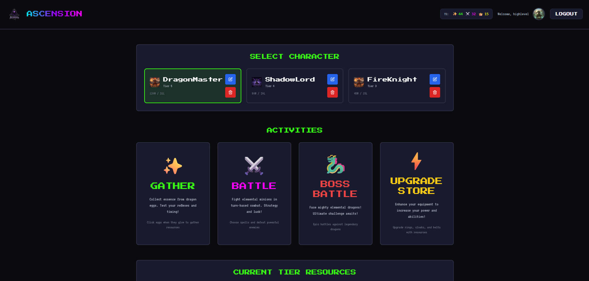

# 🔥 Ascension - The Elemental Trial

<div align="center">


**Master the elements. Battle your inner dragons. Ascend to become the ultimate mage.**

[Play Now](https://ascension2.vercel.app) | [View Demo](#screenshots) | [Report Bug](https://github.com/aabazary/ascension2/issues)

</div>

---

## 🎮 What is Ascension?

You are a mage plunged into the depths of your own subconscious, where you must undergo the **Trial of Ascension**. Battle through dragons representing each fundamental element, gather resources, upgrade your equipment, and progress through increasingly difficult tiers. 

Only after mastering all elements will you face your ultimate challenge: **a shadowy version of your own avatar** - your inner master.

**Can you Ascend?**

---

## ✨ Features

<div align="center">

| 🎭 **Create Your Mage** | ⚔️ **Battle Dragons** | 📈 **Progress & Upgrade** |
|:---:|:---:|:---:|
| Choose from 6 elemental avatars | Fight through 6 elemental tiers | Upgrade equipment and unlock new abilities |

</div>

### Core Gameplay

- 🧙 **Multiple Characters**: Create up to 3 unique characters per account
- 🐉 **Elemental Dragons**: Battle Fire, Water, Earth, Lightning, Ice, and Shadow dragons
- ⚡ **Combat System**: Choose from 3 spells with unique damage, crit, and miss rates
- 💎 **Resource Gathering**: Collect resources to upgrade your equipment
- 🎯 **Equipment System**: Upgrade your Ring, Cloak, and Belt through 7 tiers
- 🏆 **Leaderboard**: Compete with other mages for the highest win count
- 🌑 **Final Boss**: Defeat your shadowy avatar in the ultimate test

---

## 📸 Screenshots

### Dashboard - Your Command Center

*Manage your characters, view stats, and begin your journey*

### Gathering - Collect Resources

*Gather elemental resources to fuel your progression*

### Battle - Face the Dragons

*Engage in strategic battles with elemental dragons*

### Upgrade - Enhance Your Power

*Upgrade your equipment to increase your success rates*

### Leaderboard - Compete for Glory

*See how you rank against other mages*

---

## 🚀 Quick Start

### Play Online
Visit [https://ascension2.vercel.app](https://ascension2.vercel.app) to start playing immediately!

### Run Locally

```bash
# Clone the repository
git clone https://github.com/aabazary/ascension2.git
cd ascension2

# Install dependencies
npm run install-all

# Set up environment variables (see detailed setup guides below)
cd backend && cp .env.example .env
# Edit .env with your configuration

# Start both frontend and backend
npm run dev
```

Frontend runs on `http://localhost:5173` and backend on `http://localhost:5000`

**For detailed setup instructions:**
- [Backend Setup Guide](backend/README.md)
- [Frontend Setup Guide](frontend/README.md)

---

## 🎯 Game Progression

### Tier System
Progress through 7 tiers (0-6), each increasing in difficulty:

| Tier | Dragon Type | Equipment Level | Challenge |
|:---:|:---|:---:|:---|
| **0** | Dragonling | Basic | Tutorial |
| **1-5** | Elemental Dragons | Progressive | Intermediate |
| **6** | Shadow Avatar | Master | Ultimate Challenge |

### Equipment Upgrades
- **Ring**: Improves all activities
- **Cloak**: Enhances gathering success
- **Belt**: Boosts battle performance

Each piece can be upgraded through 7 tiers, dramatically improving your success rates.

---

## 🛠️ Tech Stack

- **Frontend**: React + Vite + TailwindCSS
- **Backend**: Node.js + Express + MongoDB
- **Deployment**: Vercel
- **Authentication**: JWT with httpOnly cookies

---

## 🎨 Elemental Avatars

Choose your avatar and represent your element:

🔥 **Fire Mage** | 💧 **Water Mage** | ⛰️ **Earth Mage**  
⚡ **Lightning Mage** | ❄️ **Ice Mage** | 🌑 **Shadow Mage**

Unlock additional avatars as you progress through the game!

---

## 🏗️ Project Structure

```
ascension2/
├── backend/          # Express.js API & MongoDB
├── frontend/         # React + Vite web app
└── README.md         # You are here
```

**Developer Resources:**
- [Backend Documentation](backend/README.md) - API endpoints, database schemas, game mechanics
- [Frontend Documentation](frontend/README.md) - Component structure, routing, state management

---

## 🤝 Contributing

We welcome contributions! Please feel free to submit issues and pull requests.

1. Fork the repository
2. Create your feature branch (`git checkout -b feature/AmazingFeature`)
3. Commit your changes (`git commit -m 'Add some AmazingFeature'`)
4. Push to the branch (`git push origin feature/AmazingFeature`)
5. Open a Pull Request

---

## 📄 License

This project is licensed under the MIT License - see the [LICENSE](LICENSE) file for details.

---

## 🎨 Credits

All game artwork and images were generated using **Google Gemini AI**.

---

<div align="center">

**Ready to begin your Trial of Ascension?**

[Start Playing Now](https://ascension2.vercel.app)

Made with ⚡ by Ashkon Abazary

</div>
